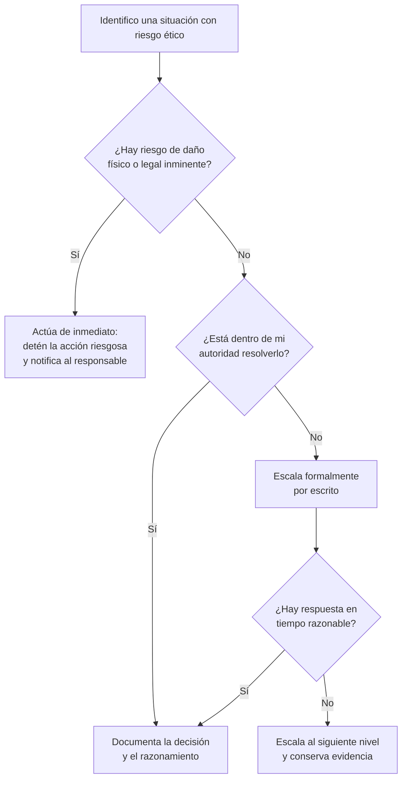

# Protocolos de actuación

Esta sección es el "qué hago ahora" del manual. Úsala cuando tengas un dilema concreto frente a ti y necesites un procedimiento, no solo principios.

## Árbol de decisión rápido



## Procedimiento estándar paso a paso

### 1. Identifica y describe el dilema sin juicios previos

Escribe los hechos, no interpretaciones. "El sistema envía el correo electrónico completo del usuario a un servicio de analítica externo sin anonimizar" es un hecho. "El equipo de analítica no le importa la privacidad" es un juicio que no ayuda a resolver nada.

### 2. Identifica a los afectados

Lista quién se ve impactado, directa e indirectamente. No olvides a terceros que no son "el usuario" pero sí están afectados (familiares, otras empresas, el público general si hay un componente de seguridad pública).

### 3. Evalúa con la matriz de riesgo

Usa la clasificación de [Riesgos](riesgos.md) para situar el caso en impacto/probabilidad.

### 4. Verifica si está dentro de tu autoridad

- Si puedes resolverlo dentro de tu rol (ej. un ajuste de código, una corrección de proceso), hazlo y documenta qué cambiaste y por qué.
- Si no está dentro de tu autoridad (afecta decisiones de producto, presupuesto, o plazos), pasa al siguiente paso.

### 5. Escala formalmente

Comunica por escrito (correo, ticket, documento compartido — nunca solo verbalmente):

- Qué identificaste.
- Qué impacto potencial tiene.
- Qué opciones de mitigación existen, con sus costos/tiempos aproximados.
- Tu recomendación explícita.

### 6. Deja constancia de la decisión final

Independientemente de quién decida, registra la decisión tomada y quién la autorizó. Esto no es para "cubrirte las espaldas": es para que el conocimiento del riesgo no se pierda y pueda revisarse después.

### 7. Si la situación involucra daño grave ya ocurrido

Pasa directamente al protocolo de [Gestión de incidentes](incidentes.md).

## Plantilla de escalamiento

```text
Asunto: Riesgo identificado en [nombre del proyecto/feature]

Descripción del hallazgo:
[Hechos concretos, sin juicios de valor]

Impacto potencial:
[Quién se ve afectado y cómo]

Clasificación de riesgo:
[Según matriz de riesgos.md: probabilidad / impacto]

Opciones de mitigación:
1. [Opción A — costo/tiempo estimado]
2. [Opción B — costo/tiempo estimado]

Recomendación:
[Tu recomendación explícita como responsable técnico]

Solicito confirmación de la decisión a tomar antes de: [fecha]
```

## Cuándo NO esperar respuesta para actuar

Hay situaciones donde escalar y esperar no es aceptable, y se debe actuar de inmediato para detener el daño, notificando en paralelo:

- Riesgo inminente a la seguridad física de personas.
- Exposición activa de datos sensibles que ya está ocurriendo (brecha en curso).
- Evidencia de uso del sistema para actividad ilegal en curso.

En estos casos, la prioridad es contener el daño primero y documentar después — sin que esto signifique actuar sin informar a nadie.

## Cuando la respuesta de la organización no es satisfactoria

Si escalaste correctamente y la organización decide ignorar un riesgo grave:

1. Verifica que tu escalamiento quedó documentado y fue recibido.
2. Evalúa si existen canales internos adicionales (comité de ética, cumplimiento, auditoría interna).
3. Considera el marco legal aplicable sobre denuncia de irregularidades (*whistleblowing*) en tu jurisdicción antes de cualquier divulgación externa.
4. Recuerda que la responsabilidad profesional incluye proteger evidencia de tu propio proceso de escalamiento, no solo "tener razón".

